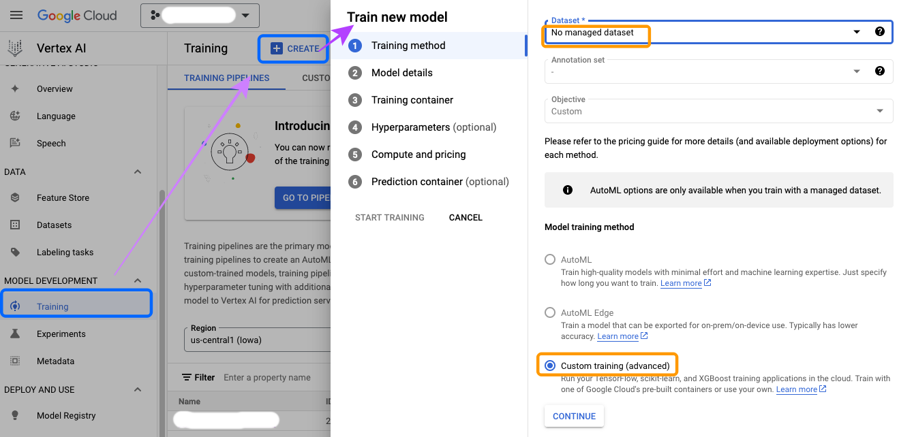
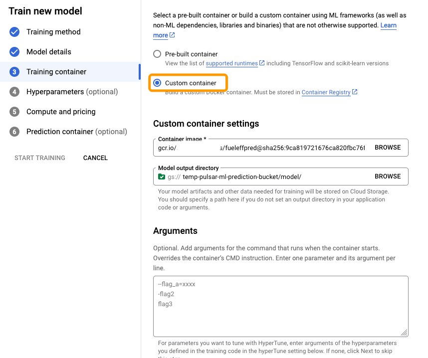
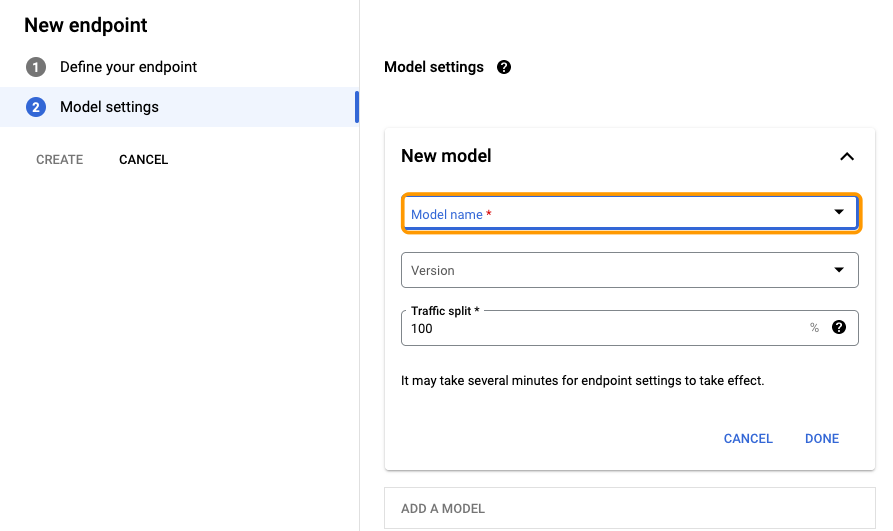

- [1. Overview](#1-overview)
- [2. Preparation](#2-preparation)
- [3. Train the Model](#3-train-the-model)
- [4. Deploy the Model on Google Vertex AI](#4-deploy-the-model-on-google-vertex-ai)
  - [4.1. Create and Publish the Docker Container](#41-create-and-publish-the-docker-container)
  - [4.2. Train the Model in Vertex AI](#42-train-the-model-in-vertex-ai)
  - [4.3. Create an Online Service Endpoint](#43-create-an-online-service-endpoint)

---

# 1. Overview

As mentioned earlier, the prediction ML model we use is to follow this [example](https://www.tensorflow.org/tutorials/keras/regression#get_the_data) from TensorFlow doc. In this document, we'll show a detailed, step-by-step procedure of how to create and deploy the prediction ML model on Google's Vertex AI platform. 

**`NOTE`**: the method we used in this demo for model deployment is following Google's [Custom Training workflow](https://cloud.google.com/vertex-ai/docs/training/overview#workflow_for_custom_training). Another approach would be to use Google's built-in AutoML model training ([doc](https://cloud.google.com/vertex-ai/docs/beginner/beginners-guide)) which could be easier. However, the training dataset used in this demo doesn't meet the minimum 1000 records requirement by AutoML. 

# 2. Preparation

* First, the following GCP enterprise APIs need to be enabled:
   * `Compute Engine API`
   * `Vertex AI API`
   * `Container Registry API`

* Secondly, a GCS bucket (e.g. `gs://temp-pulsar-ml-prediction-bucket`) needs to be created in order to save the trained ML model.
   * Remember to replace the bucket name accordingly in the provided model training program [ml-model/trainer/train.py](ml-model/trainer/train.py)
```
# TODO: replace `your-gcs-bucket` with the name of the Storage bucket you created earlier
BUCKET = 'gs://temp-pulsar-ml-prediction-bucket'
```

* Last but not the least, since the ML model is built using TensorFlow, you need to install the `tensorflow` python library if you want to test out the model training locally.
```
$ pip install tensorflow
```

# 3. Train the Model

Run the following command to test out model training locally:
```
$ cd ml-model
$ python trainer/train.py
```

Once it completes successfully, the trained model will be saved in the `model` subfolder of the created GCS bucket.

# 4. Deploy the Model on Google Vertex AI

## 4.1. Create and Publish the Docker Container

First we need to make sure the model training code is made available to the Google Vertex AI platform, the following tasks are needed:
1. Containerize the training code (e.g. in a docker container).
2. Upload and publish the docker container to the Google container registry.

The provided [ml-model/Dockerfile](ml-model/Dockerfile) and the bash script [ml-mode/buildContainer.sh](ml-model/buildDContainer.sh) are used to achieve this goal.

Please **`NOTE`** you may need to run the following 2 commands in order to successfully run the bash script [ml-mode/buildContainer.sh]
```
$ gcloud auth login
$ gcloud auth configure-docker
```

If there is no issue running the script, a docker image named `fueleffpred:latest` will be published to Google container registry. You can check the published docker image by running the following command:
```
$ gcloud container images list --project=$(gcloud config get-value project)
```

You can also view the available published image versions/tags using the following command:
```
$ gcloud container images list-tags <image_name>
```

## 4.2. Train the Model in Vertex AI

Right now, this step is completed from Google cloud console UI.

* Under "Vertex AI" -> "Model Development" -> "Training" menu, click "Create" button. Make sure to choose:
   * `No managed dataset` as the *Datasets*
   * `Custom training (advanced)` as the *Model training method*



* Follow the UI instructions; and in the "Training container" step, make sure to
   * Select the `Custom container` type, and
   * Choose the docker image that was just published
   * Choose the GCS bucket model output location that was created earlier



## 4.3. Create an Online Service Endpoint

After the model is trained in Vertex AI, you can create an endpoint for it as an online prediction service.

Under "Vertex AI" -> "Deploy and Use" -> "Online predication" menu, click "CREATE" button will pop up the "New endpoint" window. Follow the instructions on the UI and in the "Model settings" step, choose the deployed model name as in the previous step.



At this point, the online predication ML model is ready, e.g. for external rest API service calls.