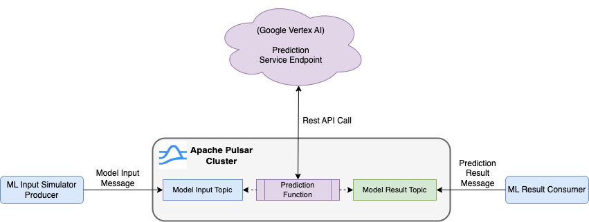

- [1. Overview](#1-overview)
- [2. Introduction to the Prediction ML Model](#2-introduction-to-the-prediction-ml-model)
  - [2.1. Make the Rest API call to the Model Endpoint](#21-make-the-rest-api-call-to-the-model-endpoint)
  - [2.2. Endpoint Access Token](#22-endpoint-access-token)
- [3. Set up the Environment and Run the Simulation](#3-set-up-the-environment-and-run-the-simulation)
  - [3.1. Set up a Pulsar Cluster](#31-set-up-a-pulsar-cluster)
  - [3.2. Global Configuration Parameters](#32-global-configuration-parameters)
  - [3.3. Deploy the Prediction Pulsar Function](#33-deploy-the-prediction-pulsar-function)
  - [3.4. Prediction Simulation Applications](#34-prediction-simulation-applications)
    - [3.4.1. Build the Applications](#341-build-the-applications)
    - [3.4.2. Run the Applications](#342-run-the-applications)
      - [3.4.2.1. Simulation Producer](#3421-simulation-producer)
      - [3.4.2.2. Simulation Consumer](#3422-simulation-consumer)
- [4. Appendix A: DSRS (dead-simple-rest-service) Rest API server](#4-appendix-a-dsrs-dead-simple-rest-service-rest-api-server)


---


# 1. Overview

This repository demonstrates how Apache Pulsar can be used to facilitate the implementation of a real-time ML model prediction service. It is important to note that the ML model utilized in this example is pre-created, pre-trained, and pre-deployed on an ML platform like Google Vertex AI. This aspect of the process is not in real-time. However, Apache Pulsar excels in enabling real-time predictions by leveraging pre-trained ML services.

The overall architecture of this demo is like below:


The above diagram illustrates the involvement of several Pulsar components:
1. A Pulsar producer generates a series of messages containing the necessary inputs for the ML model service.
2. A Pulsar function reads the ML model service inputs from an "input" topic and invokes remote service calls to the deployed ML model. The resulting predictions for each input are sent as message payloads to a separate "result" topic.
3. A Pulsar consumer retrieves the prediction results from the "result" topic.


# 2. Introduction to the Prediction ML Model

**`NOTE`**: For a more detailed, step-by-step description of how to create, train, and deploy the required ML model, please refer to the [Deploy a Simple Prediction ML Model.md](./MLModel.md) document.

In this demo, we utilize a basic regression model for automobile fuel efficiency prediction, as described in the [TensorFlow documentation](https://www.tensorflow.org/tutorials/keras/regression). The ML model will be trained and deployed on [Google's Vertex AI](https://cloud.google.com/vertex-ai) platform as a custom training model. Please note that while Google's AutoML training model is an easier option for this simple demo, it requires a minimum of 1000 records in the training dataset, which this demo doesn't fulfill.

Once the model is trained, it should be deployed as an Endpoint for online prediction. If the endpoint deployment is successful, the complete URL of the endpoint would resemble the following format:
```
https://<GCP_LOCATION>-aiplatform.googleapis.com/v1/projects/<PROJECT_ID>/locations/<GCP_LOCATION>/endpoints/<ENDPOINT_ID>:predict
```

Please **NOTE** in the above model endpoint URL
1. *<GCP_LOCATION>* is the GCP region name, e.g. us-central1
2. *<PROJECT_ID>* is the GCP project ID/Number.
3. *<ENDPOINT_ID>* is the model endpoint ID assigned to the deployed ML model

## 2.1. Make the Rest API call to the Model Endpoint

The prediction model in this demo accepts a list of 9 double values as input and returns a double value as the prediction result. For instance, if you provide the following inputs, the predicted result will be `16.0958195`
```
1.48,1.86,2.23,1.01,-2.53,-1.60,-0.46,-0.49,0.77
```

To send the input values mentioned above to the endpoint (Rest API) URL, they must be encapsulated within a JSON string formatted according to specific requirements.
```
$ cat request.json
{
    "instances": [
        [1.48,1.86,2.23,1.01,-2.53,-1.60,-0.46,-0.49,0.77]
    ]
}
```

To execute the REST API call to the model's endpoint, use the following `curl` command.
```
$ curl -X POST \
       -H "Authorization: Bearer <GCP_ACCESS_TOKEN>" \
       -H "Content-Type: application/json; charset=utf-8" \
       https://${LOCATION}-aiplatform.googleapis.com/v1/projects/${PROJECT_ID}/locations/${LOCATION}/endpoints/${ENDPOINT_ID}:predict \
       -d @/Users/yabinmeng/Temp/request.json
```

The response will include the following results. The `predictions` section contains the calculated prediction result from the ML model, along with other information about the deployed model.
```
{
  "predictions": [
    [
      16.0958195
    ]
  ],
  "deployedModelId": "<deployed_model_id>",
  "model": "projects/<porject_ID>/locations/<GCP_LOCATION>/models/<model_id>",
  "modelDisplayName": "fuel-efficiency-prediction",
  "modelVersionId": "1"
}
```

Please *NOTE* by providing a list of input values, you can make a single REST API call to the model endpoint, and it will return a corresponding list of prediction results.

## 2.2. Endpoint Access Token

The ML model endpoint is securely protected and can be accessed by providing the [Application Default Credentials (ADC)](https://cloud.google.com/docs/authentication/provide-credentials-adc). If you have properly set up ADC, you can obtain it by running the following command:
```
$ gcloud auth application-default print-access-token
```

# 3. Set up the Environment and Run the Simulation

*The detail of creating and deploying the ML model on Google Vertex AI can be found in this document: [Deploy a Simple Prediction ML Model.md](./MLModel.md)*.

---

## 3.1. Set up a Pulsar Cluster

To run this demo, you will need a Pulsar cluster that allows the deployed Pulsar function to access the remote prediction ML model endpoint. You can use any Pulsar cluster for this purpose.

For convenience, this demo includes scripts to set up a Pulsar cluster in a K8s cluster, such as Docker Desktop's built-in K8s cluster, using the DataStax Pulsar Helm chart.

You can find an example values.yaml file for the Helm chart in this demo at: [deployment/pulsar-helm/values.yaml](deployment/pulsar-helm/values.yaml). This example sets up a simple Pulsar cluster without enabling security features.

To simplify the deployment process of the Pulsar cluster, the following bash scripts are provided in this demo:

* [bash/infra/deploy_pulsar_cluster.sh](bash/infra/deploy_pulsar_cluster.sh): This script deploys a Pulsar cluster to a specific K8s namespace using the provided Helm chart example.
* [bash/infra/teardown_pulsar_cluster.sh](bash/infra/teardown_pulsar_cluster.sh): This script tears down the Pulsar cluster deployed using the above deployment script.

Please ***NOTE*** that the deployment script mentioned above will also port-forward the default Pulsar cluster listening ports 6650 and 8080 to the localhost.

## 3.2. Global Configuration Parameters

To execute the end-to-end prediction simulation workflow, certain global configuration parameters (listed below) are required. For convenience, a default properties file is provided specifically for this purpose: [conf/main-cfg.properties](conf/main-cfg.properties).
```
clientConf=./conf/conn/client.conf
inputTopic=public/default/input
outputTopic=public/default/result
useDsrsService=false
```

Among these parameters,

* `clientConf`: This parameter refers to the "client.conf" file used to establish a connection with the deployed Pulsar cluster.
* `inputTopic`: This parameter represents the Pulsar topic where the required input values for the prediction ML model are published.
* `outputTopic`: This parameter corresponds to the Pulsar topic where the prediction results or responses from the prediction ML model are returned.
* `useDsrsservice`: This parameter determines whether the Pulsar function should call the DSRS REST API or the prediction ML model REST API. It is primarily used for testing purposes. By default, its value is set to false, meaning that the Pulsar function will call the prediction ML model REST API. For more details about the DSRS REST API, please refer to [Appendix A](#4-appendix-a-dsrs-dead-simple-rest-service-rest-api-server).

## 3.3. Deploy the Prediction Pulsar Function

Before running the end-to-end prediction simulation, it is necessary to deploy the prediction Pulsar function, `rtmlsvccaller`, in the Pulsar cluster. To streamline this process, a bash script, [bash/deployRtmlSvcFunction.sh](bash/deployRtmlSvcFunction.sh), is provided for this purpose.

Internally, the script utilizes the pulsar-shell client utility to deploy the Pulsar function as demonstrated below. Therefore, it is essential to have pulsar-shell installed on your computer. For more information, please refer to the Apache Pulsar documentation for detailed instructions.
```
pulsar-shell -e "admin functions create \
  --name rtmlsvccaller \
  --auto-ack true \
  --tenant public \
  --namespace default \
  --jar ${funcPkgFile} \
  --classname com.example.rtmldemo.FuelEfficiencyMlPredSvcFunc \
  --inputs public/default/input \
  --output public/default/result \
  --user-config '{ \"useDsrsRestApi\": \"${useDsrsRestApi}\", \"restEndpoint\": \"${REST_ENDPOINT}\", \"projectId\": \"${PROJECT_ID}\", \"location\": \"${LOCATION}\", \"endpointId\": \"${ENDPOINT_ID}\", \"accessToken\": \"${ACCESS_TOKEN}\"  }'
" --fail-on-error
```

Please **NOTE** that this function requires user-defined configuration parameters as below:
```
{
    useDsrsRestApi: [true|false], 
    restEndpoint: ${REST_ENDPOINT}, 
    projectId: ${PROJECT_ID}, 
    location: ${LOCATION},
    endpointId: ${ENDPOINT_ID}, 
    accessToken: ${ACCESS_TOKEN}
}
```

Among these parameters, 
* `useDsrsRestApi`: This parameter, which defaults to false, determines whether the DSRS REST API or the prediction ML model endpoint REST API is used. We have already discussed this earlier.
* `restEndpoint`: This parameter represents the URL for either the DSRS REST API (when `useDsrsRestApi` is set to true) or the URL of the prediction ML model endpoint REST API (when `useDsrsRestApi` is set to false, which is the default).
* `projectId`, `location`, `endpointId`, and `accessToken`: These parameters are essential for a successful REST API call to the prediction ML model endpoint. They are required to provide the necessary project details, location information, endpoint identifier, and access token for authentication and authorization purposes. 

Please **`NOTE`** that when *useDsrsRestApi* is set to false (indicating that the function calls the prediction ML model endpoint), the `restEndpoint` parameter represents the base URL (as shown below), which is just a portion of the complete REST API URL. The function will automatically construct the complete URL using the other provided parameters: `projectId`, `location`, `endpointId`, and `accessToken`
```
https://${LOCATION}-aiplatform.googleapis.com/v1
```

## 3.4. Prediction Simulation Applications

After deploying the ML model endpoint and the Pulsar function, you can initiate an end-to-end prediction simulation using two simulation client applications:
* `RtmlSimulatorProducer`: This Pulsar producer client application generates a specified number of messages. Each message payload consists of a series of double values, which serve as inputs for the prediction service.
* `RtmlSimulatorConsumer`: This Pulsar consumer client application consumes a specified number of messages. The payload of each message is a JSON string that contains the response from the prediction service.

### 3.4.1. Build the Applications

The programs included in this demo are Java-based, and you can build them using the following bash scrip: [bash/build.sh](bash/build.sh).

### 3.4.2. Run the Applications

#### 3.4.2.1. Simulation Producer

To launch the simulation producer application, execute the bash script [bash/startSimulatorProducer.sh](bash/startSimulatorProducer.sh).
```
Usage: startSimulatorProducer.sh [-h]
                                 [-n <record_num>]
       -n : (Optional) The number of the records to publish.
                       default to -1, which means to receive indefinitely.
```

An example log of running this application with 2 prediction inputs published (*-n 2*) is shown as below:
```
17:17:04.596 [main] INFO  c.e.rtmldemo.RtmlSimulatorProducer - Published a message with raw value: [0] {10.48,7.98,16.71,20.55,5.58,8.13,1.06,24.93,25.88}
17:17:04.625 [main] INFO  c.e.rtmldemo.RtmlSimulatorProducer - Published a message with raw value: [1] {2.74,24.3,29.07,7.86,5.41,0.21,11.1,6.49,8.61}
17:06:48.819 [main] INFO  c.e.rtmldemo.RtmlSimulatorProducer - Terminating application: "RtmlSimulatorProducer" ...
```

#### 3.4.2.2. Simulation Consumer

To launch the simulation consumer application, execute the bash script [bash/startSimulatorConsumer.sh](bash/startSimulatorConsumer.sh).
```
Usage: startSimulatorConsumer.sh [-h]
                                 [-n <record_num>]
       -n : (Optional) The number of the records to receive.
                       default to -1, which means to receive indefinitely.
```

An example log of running this application with 2 prediction results received (*-n 2*) is shown as below:
```
17:16:58.529 [main] INFO  c.e.rtmldemo.RtmlSimulatorConsumer - Starting application: "RtmlSimulatorConsumer    " ...
17:17:05.212 [main] INFO  c.e.rtmldemo.RtmlSimulatorConsumer - (510a8) Message received and acknowledged: key=null; properties={}; value={
  "predictions": [
    [
      119.655304
    ]
  ],
  "deployedModelId": "5339177886945378304",
  "model": "projects/958416962465/locations/us-central1/models/6003889840540614656",
  "modelDisplayName": "fuel-efficiency-prediction",
  "modelVersionId": "1"
}

17:17:05.269 [main] INFO  c.e.rtmldemo.RtmlSimulatorConsumer - (510a8) Message received and acknowledged: key=null; properties={}; value={
  "predictions": [
    [
      19.8436813
    ]
  ],
  "deployedModelId": "5339177886945378304",
  "model": "projects/958416962465/locations/us-central1/models/6003889840540614656",
  "modelDisplayName": "fuel-efficiency-prediction",
  "modelVersionId": "1"
}
17:10:35.936 [main] INFO  c.e.rtmldemo.RtmlSimulatorConsumer - Terminating application: "RtmlSimulatorConsumer" ...
```

# 4. Appendix A: DSRS (dead-simple-rest-service) Rest API server 

This demo also includes a simple REST API server that allows easy testing of the end-to-end simulation process without the need to create and deploy a complex ML model.

To start and stop the DSRS REST API server, execute the following bash scripts:
* [bash/startDsrsRestSrv.sh](bash/startDsrsRestSrv.sh)
* [bash/stopDsrsRestSrv.sh](bash/stopDsrsRestSrv.sh)

Once started, the DSRS server will be running locally on port *8090*, which is chosen to avoid port conflicts with Pulsar's port of *8080*. This server has a single API endpoint, `/avg`, used for calculating the average of a series of input double values. Below is an example of how to make a call to this REST API:
```
$ curl http://localhost:8090/avg/10,20,30,40,50
{"id":1,"input_values":[10.0,20.0,30.0,40.0,50.0],"average":30.0}
```