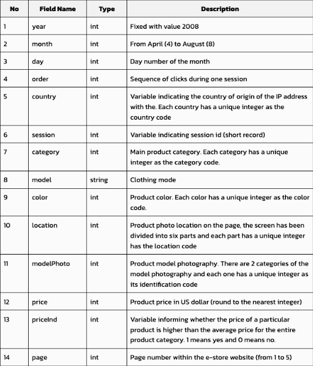

- [1. Overview](#1-overview)
- [2. Enrich the Dataset](#2-enrich-the-dataset)
  - [2.1. EventTime Column](#21-eventtime-column)
  - [2.2. SessionOrder Column](#22-sessionorder-column)
  - [2.3. Summary](#23-summary)


--


# 1. Overview

The original data soruce for the real-time complex event processing (CEP) demos in this repository is an online shopping click stream data (see [Kaggle dataset](https://www.kaggle.com/datasets/tunguz/clickstream-data-for-online-shopping)). This dataset is in CSV format and has the following columns:


# 2. Enrich the Dataset

In order to make this dataset useful for real-time complex event processing using `Apache Flink`, `Apache Spark`, or `Kaskada`, it needs to be enriched by adding a few columns

## 2.1. EventTime Column

First and foremost, the dataset doesn't have a `timestamp` based column which is required in a `Windowing` analysis which is very common in a typical real-time data processing scenario.

The raw dataset has 3 columns: `year`, `month`, and `day`. Based on these columns, we'll create a new column called `EventTime`, and it is created in a way as summarized below:
```
* For all records of the same date (the same combination of 'year', 'month', and 'day'), add 1 second per record incrementally, starting from 0.
* When the date changes, the above procedure repeats.
```

## 2.2. SessionOrder Column

Please **NOTE** that,
* Having a `timestamp` based column is good enough for real-time processing by `Apach Flink` and `Apache Spark` in our demos.

**BUT**
* It is *NOT* enough for `Kaskada` based real-time processing, which also requires an `entity key` column which is used to uniquely identify a record in the dataset.

Looking at the original dataset, the combination of the columns `session` and `order` can be used together to uniquely identify a record. Therefore, we'll create a new column, `SessionOrder`, with the following forumula:
```
Value of 'SessionOrder' = (Value of 'Session') * 1000 + (Value of 'Order')
```

## 2.3. Summary

* The newly created `EventTime` column is needed for `Apache Flink`, `Apache Spark`, and `Kaskada` based real-time processing.
* The newly created `SessionOrder` column is ONLY needed for `Kaskada` based real-time processing.
