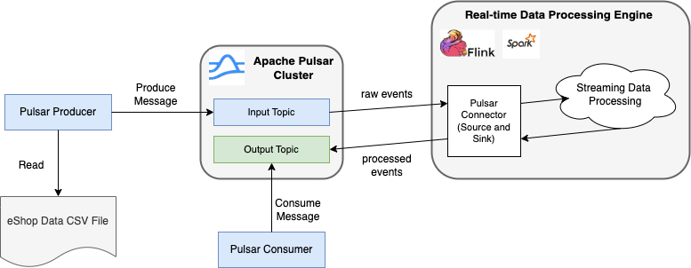

- [1. Overview](#1-overview)
  - [1.1. Source Dataset](#11-source-dataset)
  - [1.2. Build the Demo Programs](#12-build-the-demo-programs)
- [2. Set up the Environment](#2-set-up-the-environment)
  - [2.1. Set up the Infrastructure](#21-set-up-the-infrastructure)
- [3. Publish the Online Shopping Click-stream Data](#3-publish-the-online-shopping-click-stream-data)
  - [3.1. Pulsar Input Topic Schema](#31-pulsar-input-topic-schema)
- [4. Real-time Data Processing with Flink (DataSTream API)](#4-real-time-data-processing-with-flink-datastream-api)
  - [4.1. Window based "LastN" Record Aggregation](#41-window-based-lastn-record-aggregation)
  - [4.2. EShop Flink Processing Program](#42-eshop-flink-processing-program)
  - [4.3. Create a PulsarSource and a PulsarSink Connector](#43-create-a-pulsarsource-and-a-pulsarsink-connector)
    - [4.3.1. Avro Schema Serialization and Deserialization](#431-avro-schema-serialization-and-deserialization)
  - [4.4. WaterMark Strategy](#44-watermark-strategy)
  - [4.5. Stream Transformation and Aggregation](#45-stream-transformation-and-aggregation)
  - [4.6. Generate the Output Stream](#46-generate-the-output-stream)
  - [4.7. Sink the Output Stream](#47-sink-the-output-stream)
- [5. Exploration with Flink SQL](#5-exploration-with-flink-sql)
  - [5.1. Flink Table API Connectors for Pulsar](#51-flink-table-api-connectors-for-pulsar)
  - [5.2. Pulsar Catalog](#52-pulsar-catalog)
  - [5.3. Native Tables](#53-native-tables)
  - [5.4. Explicit Tables](#54-explicit-tables)
- [6. Real-time Data Processing with Flink (Table API)](#6-real-time-data-processing-with-flink-table-api)

---

# 1. Overview

This repository demonstrates an end-to-end, real-time data processing using DataStax [Astra Streaming](https://docs.datastax.com/en/streaming/astra-streaming/index.html) (Apache Pulsar), and [Apache Flink](https://flink.apache.org/).

The high level architecture of this demo and the overall data processing workflow is illustrated in the diagram below:


1. The raw source data (a CSV file) is read and loaded into a Pulsar topic ("Input Topic") via a Pulsar producer client application.
2. The messages in the Pulsar Input Topic is streamed into a Flink table via the Flink Pulsar Source connector.
3. Apache Flink processes the input data according to the required business requirements
4. The processed data is written back into another Pulsar topic ("Output Topic") via the Flink Pulsar Sink connector
5. (Optionally), a Pulsar consumer client application can read the processed data from the Pulsar Output Topic for further downstream processing (e.g. a recommendation engine)

## 1.1. Source Dataset

The input dataset used in this demo is an online shopping click-stream data. Please see the [CEP Source Dataset](../../CepDataSource.md) document for a more detailed explanation of this dataset.

For convenience purposes, the following data source files (in CSV format) are provided in this repo:
* [eshop_input_no_header.csv](../../../_data_sources/flink_spark/eshop_input_no_header.csv)
* [eshop_input_with_header.csv](../../../_data_sources/flink_spark/eshop_input_with_header.csv)

The only difference between these 2 files is one file doesn't have the title line while the other does.

## 1.2. Build the Demo Programs

The demo programs in this testing scenario are Java based and require `JDK 11`. In order to build the programs, go to the [cep/java](../../java/) subfolder in the CLI command prompt and run the following command:

```
$ mvn clean install
```

---

# 2. Set up the Environment

## 2.1. Set up the Infrastructure

In order to run this demo, we need to set up 2 clusters:

* One Apache Pulsar cluster. We can either create a `Astra Streaming tenant` or set up our own K8s-based Pulsar cluster for this purpose.
* One Apache Flink cluster. We'll deploy a Flink cluster on K8s with 1 job manager and 2 task managers.

For the `Astra Pulsar cluster`, 
* If choosing to use `Astra Streaming` as the target Pulsar cluster, please follow the UI instructions once logged in [DataStax Astra website](https://astra.datastax.com).
* If choosing to use a self-managed Pulsar cluster, the following helper bash scripts are provided for this purpose:
   *  [`deploy_pulsar_k8s.sh`](../../../_bash/infra/pulsar/deploy_pulsar_k8s.sh)
   *  [`teardown_pulsar_k8s.sh`](../../../_bash/infra/pulsar/teardown_pulsar_k8s.sh)

For the `Apache Flink cluster`, assuming a K8s cluster is up and running, and ready to connect, run the following helper bash scripts to start or stop the Flink cluster:
*  [`deploy_flink_k8s.sh`](../../../_bash/infra/flink/deploy_flink_k8s.sh)
*  [`teardown_flink_k8s.sh`](../../../_bash/infra/flink/teardown_flink_k8s.sh)

---

# 3. Publish the Online Shopping Click-stream Data

The first program, `EShopInputProducer`, is used to read the input data from the source CSV file and publishes them to the Pulsar "Input Topic". This program requires the following CLI parameters:

```
$ java -cp eshop-input-producer/target/eshop-input-producer-1.0.0.jar com.example.realtimeml.EShopInputProducer -h

usage: EShopInputProducer [-as] [-csv <arg>] [-h] [-n <arg>] [-pc <arg>] [-tp <arg>]
Command Line Options:
  -as,--astra                Whether to use Astra streaming.
  -csv,--csvFile <arg>       IoT sensor data CSV file.
  -h,--help                  Displays the usage method.
  -n,--numMsg <arg>          Number of messages to process.
  -pc,--pulsarConnFile <arg> "client.conf" file path.
  -tp,--topic <arg>          Pulsar topic name.
```

Among these parameters,
* `-as` parameter indicates whether to use "Astra Streaming" as the target Pulsar cluster.
* `-csv` parameter specifies the file path of the input source CSV file.
* `-n` parameter indicates how many data records to load and publish to the Pulsar "Input Topic".
* `-pc` parameter specifies the file path of the "client.conf" file used to connect to the Pulsar cluster.
* `-tp` parameter specifies the name of the Pulsar "Input Topic"

## 3.1. Pulsar Input Topic Schema

The `EShopInputProducer` program will publish the messages to the Pulsar "Input Topic" with the following AVRO schema (that matches the input data source).

```
{
    "type": "record",
    "name": "EShopInputData",
    "namespace": "com.example.realtimeml.pojo",
    "fields": [
        {
            "name": "category",
            "type": "int"
        },
        {
            "name": "color",
            "type": "int"
        },
        {
            "name": "country",
            "type": "int"
        },
        {
            "name": "day",
            "type": "int"
        },
        {
            "name": "eventTime",
            "type": "long"
        },
        {
            "name": "location",
            "type": "int"
        },
        {
            "name": "model",
            "type": [
                "null",
                "string"
            ],
            "default": null
        },
        {
            "name": "modelPhoto",
            "type": "int"
        },
        {
            "name": "month",
            "type": "int"
        },
        {
            "name": "order",
            "type": "int"
        },
        {
            "name": "page",
            "type": "int"
        },
        {
            "name": "price",
            "type": "int"
        },
        {
            "name": "priceInd",
            "type": "int"
        },
        {
            "name": "session",
            "type": "int"
        },
        {
            "name": "year",
            "type": "int"
        }
    ]
}
```

---

# 4. Real-time Data Processing with Flink (DataSTream API)

## 4.1. Window based "LastN" Record Aggregation

For this particular online shopping click-stream data, we're going to do a `LastN` type of analysis using Apache Flink. Basically for the incoming online shopping data, we want to get the `most recent N` records for each shopping session (sharing the same `session` field value) and aggregate/consolidate them together in certain ways. 

The aggregation/consolidation needs to be executed based on a "Windowing" strategy and the result will be put in a JSON string (and sends to the target Pulsar "Output Topic"). 

In this demo, there are 3 "Windowing" strategy depending on what type of "window" is used:
* `countWindow`: This is a global window only based on record count, but not based on the record time.
* `TumblingProcessingTimeWindows`: This is a Tumbling window based on the `processing time` of the incoming data records. 
* `TumblingEventTimeWindows`: This is a Tumbling window based on the `event time` of the incoming data records. The `event time` of an incoming record is marked by its `event_time` field.

## 4.2. EShop Flink Processing Program

The next demo program, `EShopFlinkProcessor`, is used to showcase the above analysis via the API integration between Apache Pulsar and Apache Flink. This program takes the following CLI parameters:

```
$ java -cp flink-pulsar/target/flink-pulsar-1.0.0.jar com.example.realtimeml.EShopFlinkProcessor -h
usage: EShopFlinkProcessor [-as] [-fsrv <arg>] [-h] [-lnc <arg>] [-pc <arg>] [-slds <arg>] [-snktp <arg>] [-tp <arg>] [-wnds <arg>]
       [-wndt <arg>]
Command Line Options:
  -as,--astra                Whether to use Astra streaming.
  -fsrv,--flinkServer <arg>  The flink server address. Must be in format of [embed|local|remote::<host>:<port>] (default: embed).
  -h,--help                  Displays the usage method.
  -lnc,--lastNCount <arg>    The last N count of the click numbers in the specified click stream window.
  -pc,--pulsarConnFile <arg> "client.conf" file path.
  -slds,--slideSize <arg>    The slide size of the click numbers (within a window) in the click stream.
  -snktp,--sinkTopic <arg>   The sink Pulsar topic where the processed output data is sent to.
  -tp,--topic <arg>          Pulsar topic name.
  -wnds,--windowSize <arg>   The window size of the click numbers in the click stream.
  -wndt,--windowType <arg>   Window type [etime(event_time) - default, count, or ptime(processing_time)].
```

Among these parameters,
* `-as` indicates whether to use the Astra Streaming as the target Pulsar cluster.
* `-pc` specifies the file path of the "client.conf" file used for Pulsar connection 
* `-tp` is the name of the Pulsar "Input Topic".
* `-snktp` is the name of the Pulsar "Output Topic".
* `-fsrv` specifies the Flink server address. There are 3 possible values:
   * `embed`: launches an embedded Flink server (which means an external Flink server is not needed)
   * `local`: the target Flink server is installed on the local PC. 
   * `remote::<host>:<port>`: the target Flink server is installed remotely and can be connected via the specified host address and port
* `-api` indicates which Flink API type to use. The default is the low level DataStream API (`ds`). The other option is the table API (`tbl`).
* `-lnc` specifies the count of the records in `LastN` analysis.
* `-wndt` specifies the type of the window used in the `LastN` analysis. There are 3 window types as we discussed in the previous section:
   * `count`: Global count based window (not time based window)
   * `etime`: Record event time based `tumbling window`
   * `ptime`: Record processing time based `tumbling window`
* `-wnds` specifies the size of the window, and it is only relevant when the window type is time based type. 
* `-slds` specifies the slide size of the window, and it is only relevant when the window type is time based type.

Please **NOTE** that,
 * When the window type is count based (`count`), the window size or the slide size is a positive number
 * When the window type is time based (`etime`, `ptime`), the window size or the slide size is a time duration in the following format: `<positive_number>[s|m|h|d]`

## 4.3. Create a PulsarSource and a PulsarSink Connector

Flink has built-in Pulsar Connector, both as [source](https://nightlies.apache.org/flink/flink-docs-release-1.17/docs/connectors/datastream/pulsar/#pulsar-source) and as [sink](https://nightlies.apache.org/flink/flink-docs-release-1.17/docs/connectors/datastream/pulsar/#pulsar-source) that is based on Flink's DataStream API. 

From Pulsar perspective, the Flink PulsarSource connector is simply a consumer and the Flink PulsarSink connector is simply a producer. The code of creating these connectors are quite straightforward and [PulsarSourceBuilder](https://nightlies.apache.org/flink/flink-docs-release-1.17/api/java/org/apache/flink/connector/pulsar/source/PulsarSourceBuilder.html) and [PulsarSinkBuilder](https://nightlies.apache.org/flink/flink-docs-release-1.17/api/java/index.html?org/apache/flink/connector/pulsar/sink/PulsarSinkBuilder.html) are the Flink APIs to do this job.

### 4.3.1. Avro Schema Serialization and Deserialization

In this demo, the Pulsar "Input Topic" is AVRO schema based and the "Output Topic" is (JSON) String schema based. The messages in these topics need to be properly deserialized (for `PulsarSource` connector) and serialized (for `PulsarSink` connector).

* `PulsarSource` connector deserialization. (In this demo, the POJO class [EshopInputData](../common-resources/src/main/java/com/example/realtimeml/pojo/EShopInputData.java) represents the AVRO schema of the Pulsar "Input Topic" as we explored earlier of this doc)
```
sourceBuilder.setDeserializationSchema(
    PulsarDeserializationSchema.pulsarSchema(
        Schema.AVRO(EShopInputData.class), 
        EShopInputData.class
    ))
```

* `PulsarSink` connector serialization: 
```
sinkBuilder.setSerializationSchema(
    PulsarSerializationSchema.pulsarSchema(
        Schema.STRING, String.class
    ))
```

## 4.4. WaterMark Strategy

A watermark in streaming processing is a mechanism that helps to determine which events in a stream are still relevant for processing. This is important because in streaming data, events can arrive out of order or be delayed. A watermark allows a streaming system to ignore events that are too late to be relevant for processing.

In this demo, we use Flink's built-in watermark generation strategy of [Fixed Amount of Lateness](https://nightlies.apache.org/flink/flink-docs-release-1.17/docs/dev/datastream/event-time/built_in/#fixed-amount-of-lateness).

The actual watermark strategy is a little different depending on the Windowing type being used. The code snippet is as below:

* For `global count` based windowing, there is no need for watermark
```
eShopInputDataStream = dsEnv.fromSource(
    eShopPulsarDsInputSource,
    WatermarkStrategy.noWatermarks(),
    "(Pulsar) E-Shop Count Window No Watermark Strategy");
```

* For `processing time` based windowing, the watermark stamp is based on Flink's internal processing time
```
eShopInputDataStream = dsEnv.fromSource(
    eShopPulsarDsInputSource,
    WatermarkStrategy.forBoundedOutOfOrderness(Duration.ofSeconds(5)),
    "(Pulsar) E-Shop Process Time Window with BoundedOutOfOrderness Watermark Strategy");
```

* For "event time" based windowing, the watermark stamp is based on incoming event's own timestamp

```
eShopInputDataStream = dsEnv.fromSource(
    eShopPulsarDsInputSource,
    WatermarkStrategy
        .<EShopInputData>forBoundedOutOfOrderness(Duration.ofSeconds(5))
        .withTimestampAssigner((event, timestamp) -> event.getEventTime()),
    "(Pulsar) E-Shop Event Time Window with forBoundedOutOfOrderness Watermark Strategy"
)
```

## 4.5. Stream Transformation and Aggregation

In this demo, the core streaming data processing includes 2 main parts:
1. `Field Projection`: used to filter out the required output fields in the output data stream
2. `Data Aggregation`: used to generate a JSON string that contains the last N shopping records (per window) for each shopping session.

The `field projection` processing is straightforward anc can be done via a simple map function. 

```
DataStream<EShopInputDataProjected> eShopInputDataProjectedDataStream =
    eShopInputDataStream.map((MapFunction<EShopInputData, EShopInputDataProjected>) eShopInputData ->
        new EShopInputDataProjected(
            eShopInputData.getSession(),
            eShopInputData.getOrder(),
            eShopInputData.getCategory(),
            eShopInputData.getModel(),
            eShopInputData.getColor(),
            eShopInputData.getEventTime()
    ));
```

The `data aggregation` processing is a bit complicated and there is no built-in aggregation function to use. We need to create a custom window aggregation function which needs to implement the interface of [AggregateFunction](https://nightlies.apache.org/flink/flink-docs-release-1.17/api/java/org/apache/flink/api/common/functions/AggregateFunction.html). In this demo, the class `EShopLastNAggregator` is created for this purpose. The high level structure of this function is as below. For more details, please check the [source code](./src/main/java/com/example/realtimeml/EShopFlinkProcessor.java).

```
 private static class EShopLastNAggregator
    implements AggregateFunction<EShopInputDataProjected, Map<Integer, List<EShopInputDataProjected>>, String> {

    @Override
    public Map<Integer, List<EShopInputDataProjected>> createAccumulator() {...}

    @Override
    public Map<Integer, List<EShopInputDataProjected>> add(
          EShopInputDataProjected event,
          Map<Integer, List<EShopInputDataProjected>> accumulator) { ... }

    @Override
    public Map<Integer, List<EShopInputDataProjected>> merge(
            Map<Integer, List<EShopInputDataProjected>> acc1,
            Map<Integer, List<EShopInputDataProjected>> acc2) { ... }

    @Override
    public String getResult(Map<Integer, List<EShopInputDataProjected>> accumulator) { ... }
}
```

## 4.6. Generate the Output Stream

With the above stream transformation and aggregation function in place, we can get the desired output stream that will satisfy our needs:

* For `global count` based windowing,
```
outputDataStream = eShopInputDataProjectedDataStream
    .keyBy(EShopInputDataProjected::getSession)
    .countWindow(windowSize, slideSize)
    .aggregate(new EShopLastNAggregator(lastNCnt));
```

* For `processing time` based windowing,
```
outputDataStream = eShopInputDataProjectedDataStream
    .keyBy(EShopInputDataProjected::getSession)
    .window(TumblingProcessingTimeWindows.of(Time.seconds(windowSize), Time.seconds(slideSize)))
    .aggregate(new EShopLastNAggregator(lastNCnt));
```

* For `event time` based windowing,
```
outputDataStream = eShopInputDataProjectedDataStream
    .keyBy(EShopInputDataProjected::getSession)
    .window(TumblingEventTimeWindows.of(Time.seconds(windowSize), Time.seconds(slideSize)))
    .aggregate(new EShopLastNAggregator(lastNCnt));
```

## 4.7. Sink the Output Stream

Last but not the least, the processed data can be written back to Pulsar using the previously created sink connector: 

```
outputDataStream.sinkTo(eshopPulsarDsOutputSink);
```

In the future, we'll explore using Flink's high level API, Table API, to do the same job.

---

# 5. Exploration with Flink SQL

In this section, we'll explore the integration of Apache Flink and Apache Pulsar using [Flink SQL](https://nightlies.apache.org/flink/flink-docs-release-1.17/docs/dev/table/sql/overview/); and we use Flink's built-in [SQL Client](https://nightlies.apache.org/flink/flink-docs-master/docs/dev/table/sqlclient/) utility for this purpose.

## 5.1. Flink Table API Connectors for Pulsar

Unlike the DataStream API, there are yet no built-in Flink connetors for Puslar using the Table API. We'll use [StreamNative(SN) Flink-Pulsar SQL Connector](https://streamnative.io/blog/announcing-flink-pulsar-sql-connector), the latest release of which is for Flink 1.16.0 [link](https://repo1.maven.org/maven2/io/streamnative/connectors/flink-sql-connector-pulsar/1.16.0.0/).

Meanwhile, since the Pulsar source topic is AVRO schema based, we also need the following library so that Flink SQL can properly parse the Avro schema message. This library is not part of the standard Flink release binary. 
   * [flink-sql-avro](https://mvnrepository.com/artifact/org.apache.flink/flink-sql-avro/1.16.2) (note that in this demo, we're going to use the library version for Flink 1.16.x so that it is aligned with the major version for SN's Flink-Pulsar-SQL connector.) 

Please **NOTE** that since external libraries are needed for Flink SQL integration with Pulsar, we'll use Flink's [local deployment](https://nightlies.apache.org/flink/flink-docs-release-1.17/docs/try-flink/local_installation/) method in this exploration just for convenience purposes (instead of the K8s deployment method as we used in the previous exploration).

After downloading the above 2 dependency libraries, put them in the `lib` sub-folder of Flink's local folder, and you should see something like below
```
$ ls -tlr <FLINK_HOMEDIR>/lib
total 500584
... ...
-rw-r--r--@ 1 yabinmeng  staff    3878457 Jul 13 10:32 flink-sql-avro-1.16.2.jar
-rw-r--r--@ 1 yabinmeng  staff   45390657 Jul 13 20:47 flink-sql-connector-pulsar-1.16.0.0.jar
```

At this point, run the following 2 CLI commands to start the local Flink cluster and the Flink SQL client respectively.

```
$ bin/start-cluster.sh
$ bin/sql-client.sh
```

## 5.2. Pulsar Catalog

Flink uses [Catalogs](https://nightlies.apache.org/flink/flink-docs-release-1.17/docs/dev/table/catalogs/) to store and access metadata about tables, databases, functions, and other data sources. Flink has some built-in catalog types such as [GenericInMemoryCatalog](https://nightlies.apache.org/flink/flink-docs-release-1.17/docs/dev/table/catalogs/#genericinmemorycatalog), [JdbcCatalog]([JdbcCatalog](https://nightlies.apache.org/flink/flink-docs-release-1.17/docs/dev/table/catalogs/#jdbccatalog)), etc.

The `Flink-Pulsar-SQL` connector enables the creation a `PulsarCatalog` which allows the Flink Pulsar table metadata to be stored in a dedicated Pulsar tenant and namespace.


In the FLink SQL client, run the following CLI commands to create a Pulsar catalog named `pulsar_cat_local`:
```
FLINK SQL> CREATE CATALOG pulsar_cat_local
WITH (
    'type' = 'pulsar-catalog',
    'catalog-admin-url' = 'http://localhost:8080',
    'catalog-service-url' = 'pulsar://localhost:6650'
);
```

If the target Pulsar cluster has authentication enabled, the following parameters need to be added to the above `CREATE CATALOG` command:
```
    'catalog-auth-plugin' = 'org.apache.pulsar.client.impl.auth.AuthenticationToken',
 	'catalog-auth-params' = 'token:<jwt_token_value>'
```

Once the Pulsar catalog is created, a dedicated Pulsar tenant and namespace will be used to store the Flink Pulsar table metadata. The default tenant/namespace name is `__flink_catalog/default_database`. If you want to use a different tenant/namespace, you can specify the following parameters in the `CREATE CATALOG` command:
```
    'catalog-tenant' = '<tenant_name>',
    'default-database' = '<namespace_name>'
```
(**NOTE**: there is a bug in the current SN's version of the Flink-Pulsar-SQL connector that the `default-database` parameter is not working. DataStax has improved this in its enhanced Flink-Pulsar-SQL connector.)

## 5.3. Native Tables

When a Pulsar catalog is created, Pulsar catalog automatically scans all non-system Pulsar topics in the cluster and maps each of them to a Flink table without *explicitly* creating them using the **CREATE Table** statement. These tables are called `Native Tables`. The corresponding "databases" are called as `Native Databases`.

For example, the following Flink SQL commands show all `native tables` in the `public/default` database (which points to the corresponding Pulsar namespace):
```
Flink SQL> show current catalog;
+----------------------+
| current catalog name |
+----------------------+
|     pulsar_cat_local |
+----------------------+
1 row in set

Flink SQL> use `public/default`;
[INFO] Execute statement succeed.

Flink SQL> show current database;
+-----------------------+
| current database name |
+-----------------------+
|        public/default |
+-----------------------+
1 row in set


Flink SQL> show tables;
+---------------------+
|          table name |
+---------------------+
|         eshop_input |
+---------------------+
1 row in set
```

We can read from a native table using the `SELECT` statement, as in the example below
```
Flink SQL> select * from eshop_input limit 10;
```

**NOTE**: Although readable, the native tables have some **big** limitations. For example, they don't support watermarks and primary keys. Therefore, they can't be used in "windowing" operations. For these operations, we need to **explicitly** create a table (aka, the **explicit tables**).

## 5.4. Explicit Tables

An explicit table is created using the `CREATE TABLE` statement. In the example below, an explicit table `eshopInputFlink` is created that is backed by a Pulsar topic `persistent://public/default/eshop_input` (in the specified Pulsar cluster).

```
CREATE TABLE eshopInputFlink
(
    `year`        INTEGER,
    `month`       INTEGER,
    `day`         INTEGER,
    `order`       INTEGER,
    `country`     INTEGER,
    `session`     INTEGER,
    `category`    INTEGER,
    `model`       VARCHAR,
    `color`       INTEGER,
    `location`    INTEGER,
    `modelPhoto`  INTEGER,
    `price`       INTEGER,
    `priceInd`    INTEGER,
    `page`        INTEGER,
    `eventTime`   BIGINT
) WITH (
    'connector' = 'pulsar',
    'topics' = 'persistent://public/default/eshop_input',
    'format' = 'avro',
    'admin-url' = 'http://localhost:8080',
    'service-url' = 'pulsar://localhost:6650'
);
```

There are several things to pay attention to when running the above statement:

* You need to run the above statement in a non-native database. Otherwise, you may encounter an error like below:
```
[ERROR] Could not execute SQL statement. Reason:
org.apache.flink.table.catalog.exceptions.CatalogException: Can't create explict table under pulsar tenant/namespace: public/default because it's a native database
```

* The Flink table format needs to match the Puslar topic format. In this example, the Pulsar topic has Avro schema/ and therefore the following table property needs to be specified. 
   * Please **NOTE** Avro schema format requires the dependency jar file `flink-sql-avro-1.16.2.jar` because it is not part of the standard Flink release binary.
```
...
WITH (
    ...
    'format' = 'avro',
    ...
);
```

It is worthy to mention that if the schema format doesn't match (e.g. speciying a 'json' format in the above table creation example), the `CREATE TABLE` statement will succeed. However, when you try to run a `SELECT` statement against the created table, you'll very likely run into problems related with record parsing error similar to the one below:
```
Flink SQL> select * from eshopInputFlink limit 5;
[ERROR] Could not execute SQL statement. Reason:
org.apache.flink.shaded.jackson2.com.fasterxml.jackson.core.JsonParseException: Illegal character ((CTRL-CHAR, code 2)): only regular white space (\r, \n, \t) is allowed between tokens
 at [Source: UNKNOWN; line: 1, column: 2]
```

**TBD**, at the moment, when running the `SELECT` statement against the above table `eshopInputFlink`, it keeps showing Avro deserialization problem like below. This is a blockign issue and need to be further investigated.
```
[ERROR] Could not execute SQL statement. Reason:
java.lang.ArrayIndexOutOfBoundsException: Index xxx out of bounds for length 2
```

---

# 6. Real-time Data Processing with Flink (Table API)

In the previous section 4, we explored the integration between Apache Pulsar and Apache Flink using Flink's low level API, the `DataStream API`. In this section, we'll explore the integration using Flink's high level API, the `Table API`.

**TBD**: Please stay tuned!