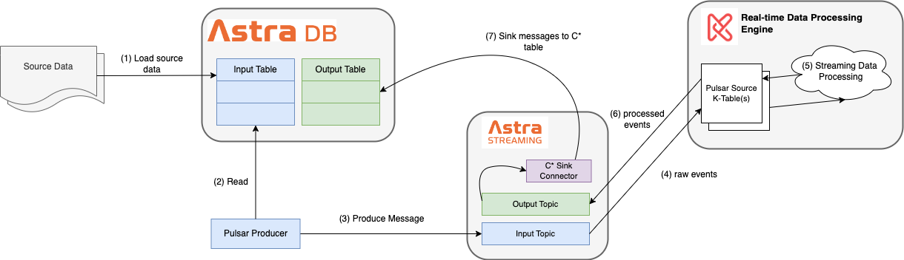

- [1. Overview](#1-overview)
  - [1.1. Source Dataset](#11-source-dataset)
- [2. Set up the Environment](#2-set-up-the-environment)
  - [2.1. Infrastructure](#21-infrastructure)
  - [2.2. Python Libraries](#22-python-libraries)
  - [2.3. Create C\* Tables and Pulsar Topics](#23-create-c-tables-and-pulsar-topics)
    - [2.3.1. Main Configuration File](#231-main-configuration-file)
    - [2.3.2. C\* Table and Pulsar Topic Schema](#232-c-table-and-pulsar-topic-schema)
  - [2.4. Load Soruce Data into the C\* Input Table](#24-load-soruce-data-into-the-c-input-table)
- [3. Real-time Data Processing with Kaskada](#3-real-time-data-processing-with-kaskada)
  - [3.1. Kaskada Data Processing](#31-kaskada-data-processing)
    - [3.1.1. Kaskada Table with PulsarSource](#311-kaskada-table-with-pulsarsource)
    - [3.1.2. Kaskada Query](#312-kaskada-query)
    - [3.1.3. Kaskada Materialization](#313-kaskada-materialization)


---


# 1. Overview

This repository demonstrates an end-to-end, real-time data processing using DataStax [Astra DB](https://docs.datastax.com/en/astra-serverless/docs/) (Apache Cassandra), [Astra Streaming](https://docs.datastax.com/en/streaming/astra-streaming/index.html) (Apache Pulsar), and [Kaskada](https://kaskada.io/).

The high level architecture of this demo and the overall data processing workflow is illustrated in the diagram below:


1. The raw source data is loaded into a C* table ("Input Table"). [Step (1) in the diagram]
2. A Pulsar producer client application reads data from the "Input Table" and publishes the data into a Pulsar topic, "Input Topic". [Steps (2) and (3) in the diagram]
3. A Kaskada table is created using the "Input Topic" as the data source. This will make the data published in the "Input Topic" automatically available in the Kaskada table. [Step (4) in the diagram]
4. The data stream from the Pulsar "Input Topic" will be processed in Kaskada as per the required business requirements. [Step (5) in the diagram]
5. The processed data will be written to another Kaskada table that has another Pulsar topic, "Output Topic" as the data source. Materializing to this Kaskada table will automatically publish the processed data into the underlying Pulsar topic. [Step (6) in the diagram]
6. The processed data landed in the Pulsar "Output Topic" will be read by a Pulsar consumer and write to the C* "Output Table". [Steps (7) and (8) in the diagram]

## 1.1. Source Dataset

Please see the [CEP Source Dataset](../../CepDataSource.md) document for a detailed explanation of the input dataset.

For `Kaskada` based data processing, the following source data files are available:
* [eshop_input_no_header.csv](../../../_data_sources/kaskada/eshop_input_no_header.csv)
* [eshop_input_with_header.csv](../../../_data_sources/kaskada/eshop_input_with_header.csv)

The only difference between these 2 files is one file doesn't have the title line while the other does.

# 2. Set up the Environment

## 2.1. Infrastructure

In order to run this demo, we need to set up 3 clusters:

* One C* cluster. We'll create an Astra DB database for this purpose.
* One Pulsar cluster. We'll create an Astra Streaming tenant for this purpose.
* One Kaskada cluster. Since there is no "as-a-service" type of offering for Kaskada, we'll deploy a local Kaskada cluster.
 For the `Astra DB database` and the `Astra Streaming tenant`, log in the [DataStax Astra website](https://astra.datastax.com) and follow the UI instructions.

For the `local Kaskada cluster`,
* First download the Kaskada binaries to a local folder, following the procedure as listed in [this Kaskada doc](https://kaskada.io/docs-site/kaskada/main/installing.html#using-kaskada-with-the-command-line-cli).

* Run the following helper bash scripts to start or stop the local Kaskada cluster:
  *  [`deploy_kaskada_local.sh`](../../../_bash/infra/kaskada/deploy_kaskada_local.sh)
  *  [`teardown_kaskada_local.sh`](../../../_bash/infra/kaskada/teardown_kaskada_local.sh)

## 2.2. Python Libraries

The demo python programs require the following libraries to be installed in advance:
```
# Cassandra client driver
pip install cassandra-driver


# Pulsar client driver base and Avro Schema support
pip install pulsar-client --upgrade
pip install pulsar-client[avro] --upgrade


# Kaskada client driver
pip install kaskada --upgrade


# Other python libraries
pip install jproperties --upgrade
pip install requests --upgrade
```

## 2.3. Create C* Tables and Pulsar Topics

Before the core real-time data processing happens in Kaskada, we need to do some preparation work such as:
* Create C* tables, "Input Table" and "Output Table"
* Load raw source data into the "Input Table"
* Create Pulsar namespaces and/or topics
* Deploy a Pulsar C* sink connector


(**NOTE**: the C* keyspace needs to be created manually in the Astra DB UI)


This demo includes a Python program, [prepEnv.py](./code/prepEnv.py) for this purpose. This program is CLI based that takes the following input parameters:
```
usage: prepEnv.py [-h] [-cf CFILE] [-cpt CREATEPULSARTOPIC] [-cdt CREATEDBTBL] [-ldr LOADRAWSRC] [-rsf RAWSRCFILE] [-ldn LOADRECNUM]


options:
 -h, --help            show this help message and exit
 -cf CFILE, --cfile CFILE
                       main configuration file
 -cdt CREATEDBTBL, --createDbTbl CREATEDBTBL
                       create Astra DB tables (input and output)
 -cpt CREATEPULSARTOPIC, --createPulsarTopic CREATEPULSARTOPIC
                       create Astra Streaming topics (input and output)
 -ldr LOADRAWSRC, --loadRawSrc LOADRAWSRC
                       load raw data records into the Astra DB input table
 -rsf RAWSRCFILE, --rawSrcFile RAWSRCFILE
                       source file that has the raw data
 -ldn LOADRECNUM, --loadRecNum LOADRECNUM
                       number of the records to be loaded from the source file (-1 means to load all)
```

Among these parameters,
* `-cf` parameter is used to specify a main demo configuration file (more on this in the next section)
* `-cdt` parameter (default to `true`) specifies whether to create the required C* tables, the details of which are specified in the main configuration file.
* `-cpt` parameter (default to `true`) specifies whether to create the required Pulsar topics (and C* sink connector), the details of which are specified in the main configuration file.
* `-ldr`, `-rsf`, and `-ldn` parameters are related with whether and how to load the raw data into the C* input table
  * `ldr` (default to `false`) specifies whether to load the raw data
  * `-rsf` specifies the raw data source file path
  * `-ldn` specifies how many records to be loaded

### 2.3.1. Main Configuration File

The following required information is provide via the main configuration file:
* C* related information
 * The connection information to the Astra DB database
 * The names of the C* keyspace, input table, and output table
* Pulsar related information
 * The connection information to the Astra Streaming tenant
 * The names of the Pulsar tenant, namespace, input topic, and output topic
 * Whether to use Avro as the input topic schema
* Kaskada related information
 * Kaskada deployment mode (`local`)
 * Kaskada connection endpoint


A template of the main configuration file is provided for reference: [main-cfg.properties.template](./conf/main-cfg.properties.template)

### 2.3.2. C* Table and Pulsar Topic Schema

In this demo, the C* tables and Pulsar topics (must) have matching schemas. 

For C* tables, their schema definition is as below:

| C* Table | Schema Definition File |
| -------- | ---------------------- |
| Input Table | [input_tbl.stmt](./conf/cql-cassandra/input_tbl.stmt) |
| Output Table | [output_tbl.stmt](./conf/cql-cassandra/output_tbl.stmt) |

For Pulsar topics, their schemas *must* be Avro Schema; and they can either be explicitly pre-created via `prepEnv.py` program if the following main configuration item is set to True:
```
as.topic.schema=True
```

If so, their schema definition is as below:

| Pulsar Topic | Schema Definition File |
| ------------ | ---------------------- |
| Input Topic | [input_topic.json](./conf/pulsar-schema/input_topic.json) |
| Output Topic | [output_topic.json](./conf/pulsar-schema/output_topic.json) |

Otherwise, the Pulsar topic schemas will be implicitly created via `mainProc.py` program when running the workload (more on this in the next chapter)

## 2.4. Load Soruce Data into the C* Input Table

By default, when running the `prepEnv.py` program, it only creates the C* and/or Pulsar resources. But it can also be used to load the source dataset into the C* "Input Table" by providing the following input parameters:

```
$ python prepEnv.py \
   -cf </path/to/main/configuration/file> \
   -ldr True \
   -rsf </path/to/_data_sources/kaskada/eshop_input_no_header.csv> \
   -ldn [-1 | <a positive number>] ## -1 means all records in the data source file
```
# 3. Real-time Data Processing with Kaskada

Once the environment is ready, we can run the main program, [mainProc.py](./code/mainProc.py), to kick off different execution workloads.

```
usage: mainProc.py [-h] [-cf CFILE] [-wt WORKLOADTYPE] [-ldn LOADRECNUM]

options:
 -h, --help            show this help message and exit
 -cf CFILE, --cfile CFILE
                       Main configuration file
 -wt WORKLOADTYPE, --workloadType WORKLOADTYPE
                       Valid workload type. Must be one of "producer, processor, consumer"
 -ldn LOADRECNUM, --loadRecNum LOADRECNUM
                       The number of the records to be loaded from the source into a Pulsar topic. Only relevant when workload type is 'producer'
```

Among these parameters,
* `-cf` parameter is used to specify a main demo configuration file (as already explored earlier)
* `-wt` parameter is used to specify the type of the workload to execute.
  *  `producer`: A Pulsar producer reads data from the C* Input Table and publishes them to the Pulsar Input Topic (corresponds to steps (2) and (3) in the diagram)
  *  `processor`: Kaskada real-time processing that reads the source data from the Pulsar Input Topic and materialize the processed data into the Pulsar Output Topic (corresponds to steps (4), (5), and (6) in the diagram)
  *  `consumer`: A Pulsar consumer reads data from the Pulsar Output Topic and writes them into the C* Output Table (corresponds to steps (7) and (8) in the diagram)
* `-ldn` parameter is used to specify how many records to read from the C* Input Table and write to the Pulsar Input Topic. By default, (value "-1") it loads all data from the C* Input Table.
  * It is optional and **only** relevant when the workload type is `producer`

## 3.1. Kaskada Data Processing

The `producer` and `consumer` workloads are simple and straightforward. We'll therefore put our focus in this document to the `processor` workload which is to utilize Kaskada server's capability for real-time data processing.

### 3.1.1. Kaskada Table with PulsarSource

Kaskada stores data in tables. In order to avoid confusions, we'll use the term ***Kaskada Table*** in the rest of this document. Each Kaskada table has a schema associated with it and the schema must follow certain requirements. For details, please [Kaskada document](https://kaskada.io/docs-site/kaskada/main/developing/tables.html) for more details.

A Kasaka table can have a Pulsar topic as its source. This requires that the Puslar topic also should have a schema that matches the Kaskada table schema. In particular,
* The Pulsar topic schema must be an `AVRO` schema.
* The Pulsar topic schema must include two columns that correspond to the `time` column and the `entity key` column as required by a Kaskada table

The python code snippet to create a (Astra Streaming) Pulsar topic backed table named `kasTblInput` is as below:

```
import kaskada.table as kt

puslar_tbl_source = kt.PulsarTableSource('pulsar+ssl://pulsar-gcp-uscentral1.streaming.datastax.com:6651',
                                         'https://pulsar-gcp-uscentral1.api.streaming.datastax.com',
                                         'org.apache.pulsar.client.impl.auth.AuthenticationToken',
                                         'token:<pulsar_jwt_token_value>',
                                         'rt-kas-proc',
                                         'default',
                                         'rt_kas_input_tp')

kt.create_table(table_name='kasTblInput',
                time_column_name='event_time',
                entity_key_column_name='so_key',
                source=puslar_tbl_source)
```

Once created, you can verify the details of this Kaskada table using the following CLI command. It will show the Kaskada table schema (which maps to the Pulsar toic schema) and the Pulsar configuration details.

```
$ kaskada-cli table get kasTblInput

tableId: 4b02597e-b26e-4628-8254-d148a4cc3746
tableName: kasTblInput
timeColumnName: event_time
entityKeyColumnName: so_key
createTime: 2023-07-21T23:20:07.885177Z
updateTime: 2023-07-21T23:20:07.885178Z
schema:
  fields:
  - name: year
    dataType:
      primitive: PRIMITIVE_TYPE_I32
  - name: month
    dataType:
      primitive: PRIMITIVE_TYPE_I32
  - name: day
    dataType:
      primitive: PRIMITIVE_TYPE_I32
  - name: order_seq
    dataType:
      primitive: PRIMITIVE_TYPE_I32
  - name: country
    dataType:
      primitive: PRIMITIVE_TYPE_I32
  - name: session
    dataType:
      primitive: PRIMITIVE_TYPE_I32
  - name: category
    dataType:
      primitive: PRIMITIVE_TYPE_I32
  - name: model
    dataType:
      primitive: PRIMITIVE_TYPE_STRING
  - name: color
    dataType:
      primitive: PRIMITIVE_TYPE_I32
  - name: location
    dataType:
      primitive: PRIMITIVE_TYPE_I32
  - name: photography
    dataType:
      primitive: PRIMITIVE_TYPE_I32
  - name: price
    dataType:
      primitive: PRIMITIVE_TYPE_I32
  - name: price_ind
    dataType:
      primitive: PRIMITIVE_TYPE_I32
  - name: page
    dataType:
      primitive: PRIMITIVE_TYPE_I32
  - name: event_time
    dataType:
      primitive: PRIMITIVE_TYPE_I64
  - name: so_key
    dataType:
      primitive: PRIMITIVE_TYPE_I32
source:
  pulsar:
    config:
      brokerServiceUrl: pulsar+ssl://pulsar-gcp-uscentral1.streaming.datastax.com:6651
      adminServiceUrl: https://pulsar-gcp-uscentral1.api.streaming.datastax.com
      authPlugin: org.apache.pulsar.client.impl.auth.AuthenticationToken
      authParams: <jwt_token_value>
      tenant: rt-kas-proc
      namespace: default
      topicName: rt_kas_input_tp
```

### 3.1.2. Kaskada Query

In Kaskada, the data cmoputation is normally executed via [queries](https://kaskada.io/docs-site/kaskada/main/developing/queries.html). 

Unfortunately at the moment, Kaskada query is only available for file backed Kaskada tables and *not yet available for Pulsar topic backed Kaskada tables*. For instance, in the example below, `kasTblInput` is a Kaskada Table backed by 

```
$ echo "kasTblInput | select_fields($input, 'year', 'month', 'day')" | kaskada-cli query run

Enter the expression to run and then press CTRL+D to execute it, or CTRL+C to cancel:

Executing query...

11:35AM FTL  error="rpc error: code = InvalidArgument desc = query is currently not supported on tables backed by streams"
```

### 3.1.3. Kaskada Materialization

[Kaskada Materialization](https://kaskada.io/docs-site/kaskada/main/developing/materializations.html) is the method of writing the results of Kaskada query into an external data store. It also supports writing data into a Pulsar topic.

Creating a Kaskada materialization involves defining a Kaskada query as part of its definition. We can therefore use this as a workaround of not being able to directly run a Kaskada query "service" against a Pulsar topic backed Kaskada table. The example of below shows how to do this:

```
import kaskada.materialization as km

materialization_query = """
{{
    year: kasTblInput.year,
    month: kasTblInput.month,
    day: kasTblInput.day,
    order_seq: kasTblInput.order_seq,
    session: kasTblInput.session,
    category: kasTblInput.category,
    model: kasTblInput.model,
    price: kasTblInput.price,
    price_ind: kasTblInput.price_ind,
    event_time: kasTblInput.event_time,
    so_key: kasTblInput.so_key,
}}
"""

pulsar_destination = km.PulsarDestination(
   'rt-kas-proc',
   'default',
   'rt_kas_outut_tp',
   'pulsar+ssl://pulsar-gcp-uscentral1.streaming.datastax.com:6651',
   'https://pulsar-gcp-uscentral1.api.streaming.datastax.com',
   'org.apache.pulsar.client.impl.auth.AuthenticationToken',
   'token:<pulsar_jwt_token_value>')

km.create_materialization(
    name='mat-rt_kas_output_tp',
    destination=pulsar_destination,
    expression=materialization_query,
    views=[]
)
```

Once created, you can verify the details of this Kaskada materialization using the following CLI command. It will show the Kaskada materialization details like the output Pulsar topic connection information, schema, etc.

```
$ kaskada-cli materialization get mat-rt_kas_output_tp

materializationId: 7cca4ba5-6661-4839-9ffb-2b7414833a5d
materializationName: mat-rt_kas_output_tp
createTime: 2023-07-21T23:20:07.907380Z
expression: |-

              {
                  year: kasTblInput.year,
                  month: kasTblInput.month,
                  day: kasTblInput.day,
                  order_seq: kasTblInput.order_seq,
                  session: kasTblInput.session,
                  category: kasTblInput.category,
                  model: kasTblInput.model,
                  price: kasTblInput.price,
                  price_ind: kasTblInput.price_ind,
                  event_time: kasTblInput.event_time,
                  so_key: kasTblInput.so_key,
              }

destination:
  pulsar:
    config:
      brokerServiceUrl: pulsar+ssl://pulsar-gcp-uscentral1.streaming.datastax.com:6651
      adminServiceUrl: https://pulsar-gcp-uscentral1.api.streaming.datastax.com
      authPlugin: org.apache.pulsar.client.impl.auth.AuthenticationToken
      authParams: token:<jwt_token_value>
      tenant: rt-kas-proc
      namespace: default
      topicName: rt_kas_output_tp
schema:
  fields:
  - name: year
    dataType:
      primitive: PRIMITIVE_TYPE_I32
  - name: month
    dataType:
      primitive: PRIMITIVE_TYPE_I32
  - name: day
    dataType:
      primitive: PRIMITIVE_TYPE_I32
  - name: order_seq
    dataType:
      primitive: PRIMITIVE_TYPE_I32
  - name: session
    dataType:
      primitive: PRIMITIVE_TYPE_I32
  - name: category
    dataType:
      primitive: PRIMITIVE_TYPE_I32
  - name: model
    dataType:
      primitive: PRIMITIVE_TYPE_STRING
  - name: price
    dataType:
      primitive: PRIMITIVE_TYPE_I32
  - name: price_ind
    dataType:
      primitive: PRIMITIVE_TYPE_I32
  - name: event_time
    dataType:
      primitive: PRIMITIVE_TYPE_I64
  - name: so_key
    dataType:
      primitive: PRIMITIVE_TYPE_I32
slice: {}
analysis:
  fenlDiagnostics: {}
  canExecute: true
  freeNames:
  - kasTblInput
```

***TBD***: as of 07/24/2023, there is one AVRO message deserialization issue (see below) pending further investigation when using Kaskada Materialization
```
[2m2023-07-21T20:24:28.236579Z[0m [34mDEBUG[0m [1mOperation[0m[1m{[0mindex=0 operation_label="scan"[1m}[0m[2m:[0m reading pulsar messages
[2m2023-07-21T20:24:28.267486Z[0m [34mDEBUG[0m [1mOperation[0m[1m{[0mindex=0 operation_label="scan"[1m}[0m[2m:[0m error deserializing message: DeserializeErrorWrapper(
    [1merror reading Avro record[22m
    ├╴at [3mcrates/sparrow-runtime/src/streams/pulsar/stream.rs:115:14[23m
    │
    ╰─▶ [1mwrong magic in header[22m
        ├╴at [3mcrates/sparrow-runtime/src/streams/pulsar/stream.rs:114:14[23m
        ╰╴span trace with 1 frames (1)
    
    ━━━━━━━━━━━━━━━━━━━━━━━━━━━━━━━━━━━━━━━━
    
    span trace No. 1
       0: sparrow_runtime::execute::compute_executor::Operation
               with index=0 operation_label="scan"
                 at crates/sparrow-runtime/src/execute/compute_executor.rs:141,
```
