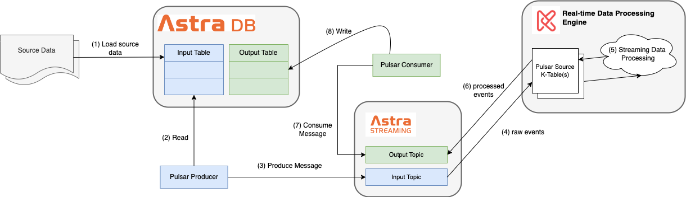

---

# 1. Overview

This repository demonstrates an end-to-end, real-time data processing using DataStax [Astra DB](https://docs.datastax.com/en/astra-serverless/docs/) (Apache Cassandra), [Astra Streaming](https://docs.datastax.com/en/streaming/astra-streaming/index.html) (Apache Pulsar), and [Kaskada](https://kaskada.io/). 

The high level architecture of this demo and the overall data processing workflow is illustrated in the diagram below:


1. The raw source data is loaded into a C* table ("Input Table"). [Step (1) in the diagram]
2. A Pulsar producer client application reads data from the "Input Table" and publishes the data into a Pulsar topic, "Input Topic". [Steps (2) and (3) in the diagram]
3. A Kaskada table is created using the "Input Topic" as the data source. This will make the data published in the "Input Topic" automatically available in the Kaskada table. [Step (4) in the diagram]
4. The data stream from the Pulsar "Input Topic" will be processed in Kaskada as per the required business requirements. [Step (5) in the diagram]
5. The processed data will be written to another Kaskada table that has another Pulsar topic, "Output Topic" as the data source. Materializing to this Kaskada table will automatically publish the processed data into the underlying Pulsar topic. [Step (6) in the diagram]
6. The processed data landed in the Pulsar "Output Topic" will be automatically sinked to the  C* "Output Table", using a Pulsar-to-C* sink connector. [Step (7) in the diagram]


# Set up the Demo Environment and Run the Simulation 

## Infrastructure Setup

In order to run this demo, we need to set up 3 clusters:

* One C* cluster. We'll create an Astra DB database for this purpose.
* One Pulsar cluster. We'll create an Astra Streaming tenant for this purpose.
* One Kaskada cluster. Since there is no "as-a-service" type of offering for Kaskada, we'll deploy a local Kaskada cluster.
  
For the `Astra DB database` and the `Astra Streaming tenant`, log in the [DataStax Astra website](https://astra.datastax.com) and follow the UI instructions.

For the local Kaskada cluster, 
* First download the Kaskada binaries to a local folder, following the procedure as listed in [this Kaskada doc](https://kaskada.io/docs-site/kaskada/main/installing.html#using-kaskada-with-the-command-line-cli).

* Run the following helper bash scripts to start or stop the local Kaskada cluster:
   *  [`deploy_kaskada_local.sh`](../../../_bash/infra/kaskada/deploy_kaskada_local.sh)
   *  [`teardown_kaskada_local.sh`](../../../_bash/infra/kaskada/teardown_kaskada_local.sh)


## Python Libraries

The demo programs are python programs and require the following Python libraries to be installed in advance:
```
# Cassandra client driver
pip install cassandra-driver

# Pulsar client driver base and Avro Schema support
pip install pulsar-client --upgrade
pip install pulsar-client[avro] --upgrade

# Kaskada client driver
pip install kaskada --upgrade

# Other python libraries
pip install jproperties --upgrade
pip install requests --upgrade
```

## Create C* Tables, Pulsar Topics, and Load Raw Source Data

Before the core real-time data processing happens in Kaskada, we need to do some preparation work such as:
* Create C* tables, "Input Table" and "Output Table"
* Load raw source data into the "Input Table"
* Create Pulsar namespaces and/or topics
* Deploy a Pulsar C* sink connector

(**NOTE**: the C* keyspace needs to be created manually in the Astra DB UI)

This demo includes a Python program, [prepEnv.py](./code/prepEnv.py) for this purpose. This program is CLI based that takes the following input paramters:
```
usage: prepEnv.py [-h] [-cf CFILE] [-cpt CREATEPULSARTOPIC] [-cdt CREATEDBTBL] [-ldr LOADRAWSRC] [-rsf RAWSRCFILE] [-ldn LOADRECNUM]

options:
  -h, --help            show this help message and exit
  -cf CFILE, --cfile CFILE
                        main configuration file
  -cdt CREATEDBTBL, --createDbTbl CREATEDBTBL
                        create Astra DB tables (input and output)
  -cpt CREATEPULSARTOPIC, --createPulsarTopic CREATEPULSARTOPIC
                        create Astra Streaming topics (input and output)
  -ldr LOADRAWSRC, --loadRawSrc LOADRAWSRC
                        load raw data records into the Astra DB input table
  -rsf RAWSRCFILE, --rawSrcFile RAWSRCFILE
                        source file that has the raw data
  -ldn LOADRECNUM, --loadRecNum LOADRECNUM
                        number of the records to be loaded from the source file (-1 means to load all)
```

Among these parameters,
* `-cf` parameter is used to specify a main demo configuration file (more on this in the next section)
* `-cdt` parameter (default to `true`) specifies whether to create the required C* tables, the details of which are specified in the main configuration file.
* `-cpt` parameter (default to `true`) specifies whether to create the required Pulsar topics (and C* sink connector), the details of which are specified in the main configuration file.
* `-ldr`, `-rsf`, and `-ldn` parameters are related with whether and how to load the raw data into the C* input table
   * `ldr` (default to `false`) specifies whether to load the raw data
   * `-rsf` specifies the raw data source file path
   * `-ldn` specifies how many records to be loaded

### Main Configuration File


